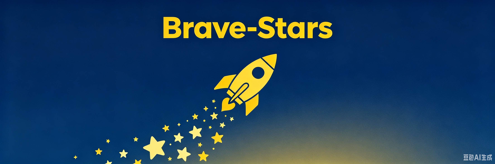

  

# ⭐ Brave-Stars

> Special Education · Open Resources · AI Empowerment

## 📌 Overview

**Brave-Stars** is an online platform dedicated to **special education resource sharing** and **AI-powered support**. It addresses three critical challenges in China's special education landscape:

- **Uneven distribution of resources** – Teachers in underdeveloped areas lack access to quality training and materials.
- **Delayed diagnosis** – Most schools rely on subjective teacher experience rather than data-driven assessment tools.
- **Lack of family support** – Parents of children with special needs often receive little professional guidance.

The platform currently features three core modules:

1. **Special Education Course Library** – Curated video courses and materials from domestic and international sources.
2. **Community** – A space for teachers, parents, and researchers to connect and share.
3. **AI Chat (prototype)** – An affective AI system for emotional support and conversation practice.

## 🎥 Project Demo

*Click the image above to watch a 45-second walkthrough of the platform.*

> **Note:** Replace `PLACEHOLDER` with your actual YouTube video ID after recording your demo.

## 🧠 My Motivation

Growing up, I witnessed firsthand how early intervention can transform the life of a child with special needs — and how devastating it is when families lack access to timely support. My mother's work in special education gave me a window into both the challenges and the breakthroughs.

This project is my first step toward using technology to address these inequalities:

1. First, I built a **knowledge hub** to lower the barrier to high-quality special education resources.
2. Next, I plan to integrate **AI tools** (NLP, LLMs, recommendation systems) for screening, personalized learning, and teacher assistance.
3. Long-term, I envision a **complete support ecosystem** — from early screening to intervention and community connection.

## 👤 My Role

This is a **solo project**. I handled everything from concept to implementation:

- Needs analysis and product definition
- UI/UX design and front-end development (HTML, CSS, JavaScript, Bootstrap)
- Documentation and portfolio preparation

During the process, I encountered challenges with LLM deployment and reached out to a university professor for guidance. He recommended starting with **Llama**, which led directly to my first internship at **Hanyi Fonts** (AI LLM department), where I gained hands-on experience in multilingual data pipelines for LLM training.

## 🛠️ Tech Stack

| Layer | Technology |
| :--- | :--- |
| **Frontend** | Bootstrap 5.3, HTML5, CSS3, JavaScript |
| **Interactivity** | Vanilla JS (event listeners, DOM manipulation) |
| **Version Control** | Git + GitHub Pages |
| **Future Backend** | Flask / FastAPI + Ollama / Llama.cpp (planned) |

## 🗺️ Technical Roadmap

| Phase | Status | Description |
| :--- | :---: | :--- |
| **Phase 1: Static Prototype** | ✅ Done | UX validation, concept communication, portfolio showcase |
| **Phase 2: Backend Integration** | 🔄 In Progress | Flask/FastAPI, user authentication, database (SQLite/PostgreSQL) |
| **Phase 3: LLM Deployment** | 📋 Planned | Ollama for local inference, fine-tuned on special education datasets (FLAMENCO, TalkBank) |
| **Phase 4: Pilot Deployment** | 🌟 Vision | Partner with 2-3 special education schools, collect real-world feedback, iterate |

## 📅 12-Month Project Timeline

| Timeline | Milestone | Key Tasks |
| :--- | :--- | :--- |
| **Q3 2026** | ✅ Complete Prototype · Collect Feedback | Finish static prototype, share with special education teachers, iterate UX |
| **Q4 2026** | 🔄 Backend & LLM Integration | Build Flask/FastAPI backend, integrate open-source LLM (Llama 3 / Qwen) via Ollama, deploy on cloud |
| **Q1 2027** | 📋 Pilot with Special Education Schools | Partner with 2-3 schools, collect real-world data and teacher/parent feedback, iterate AI models |
| **Q2 2027+** | 🌟 Scale & Open Source | Open-source the platform, expand to more schools, publish research paper on AI + Special Education outcomes |

## 🎨 Interaction Design

| Page | Key Interaction | Implementation |
| :--- | :--- | :--- |
| **Home** | Three module cards → click to navigate | Bootstrap buttons + `<a>` links |
| **Special Education** | Course menu → click to switch video | JavaScript `changeVideo()` updates iframe `src` |
| **Community** | Registration form + discussion feed | Vanilla JS form handling + DOM manipulation |
| **AI Chat** | Real-time conversation simulation | Intent detection + dynamic response generation |

## 🚧 Challenges & Solutions

| Challenge | Solution | Lesson Learned |
| :--- | :--- | :--- |
| **LLM training resource bottleneck** | Consulted professor → advised starting with Llama → led to internship at Hanyi Fonts | Real-world AI requires practical engineering, not just theory |
| **Static page limitations** | Planned backend integration (FastAPI + Ollama) for future versions | Start with a working prototype, iterate toward full product |
| **YouTube video accessibility** | Embedded B站 videos for reliable access in China | Always consider your target audience's access constraints |

## 🔗 Live Demo

👉 [https://041022-wz.github.io/brave-stars/](https://041022-wz.github.io/brave-stars/)

## 📅 Status

- **Version**: v1.0 (concept prototype)
- **Last Updated**: June 2026
- **Purpose**: Graduate application portfolio

## 📄 License

MIT License © 2026 Wei Zheng
